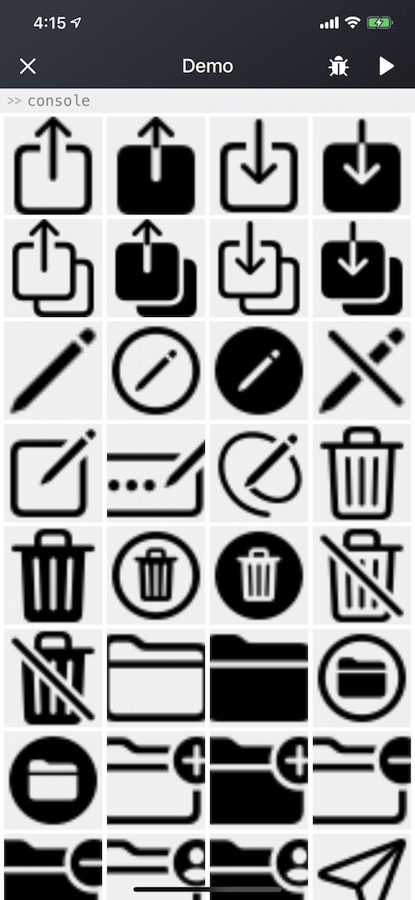
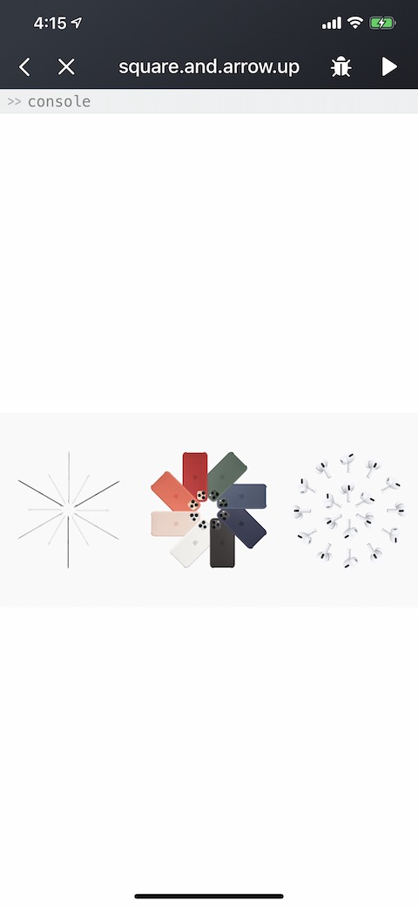

# JSBox Lazy Loading

This demo shows you how to create a grid-based layout in [JSBox](https://apps.apple.com/app/id1312014438), with infinite items. Each item shows a placeholder at the beginning, when its URL is ready, it loads the resource automatically (using mock data).

Besides, there's a request queue that can be used in the background, to pre-fetch large images.

# Highlights

There are 3 things I wanted to show you in this demo:

- Creating placeholder which supports lazy loading (See thumb.js)
- Implementing the cache layer
- Leveraging [bottleneck.js](https://www.npmjs.com/package/bottleneck) for task throttling